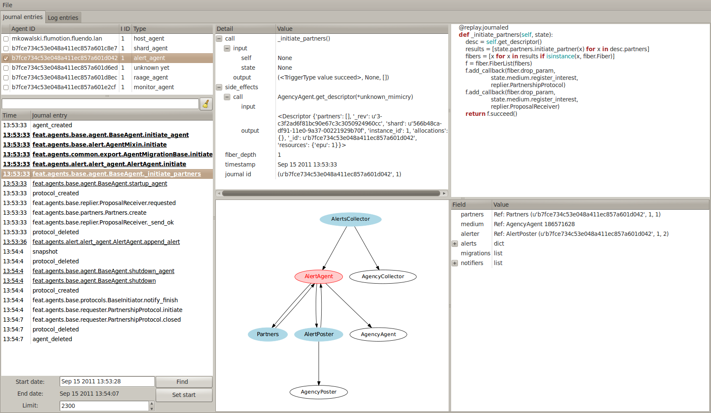

:Author: Marek Kowalski
:Contacts: kowalski0123 (at) gmail.com


====================
Introduction to FEAT
====================


.. sidebar:: Contents

    .. contents::

.. sectnum::

Feat is a set of utility classes built on top of the well-known Twisted_
Python_ library which simplifies the development of distributed
applications. A Feat-based application consists of a number of
agents of different types, which form a 'society' to solve some a
given problem.

.. _Twisted: http://www.twistedmatrix.com/
.. _Python: http://www.python.org/

What kind of problem would that be ? Well, anything that requires
the use of multiple hosts, communicating between one another, would
qualify. It has been created to help us develop the backend of
LiveTranscoding_

.. _LiveTranscoding: http://www.livetranscoding.com/

The goal in LiveTranscoding is to handle the huge number of encoding machines,
keep track of their CPU, memory and bandwidth usage, and run some
network services on them, which enables the system to create and encode
the live stream.

To make the system predictable, it has to be highly testable. To
meet this requirement we have introduced the concept of dependency
labours and execution modes. The real resource-intensive work is
performed by production mode labour implementations. For testing and
simulation purposes, we have different implementations which merely
expose the same interface, without actually encoding and thus consuming
CPU resources.

The code of the agents themselves is replayable. This means that
while the service is running, we record and store enough information on
disk [#]_ to be able to restore the state of
any agent at any time in history. This led us to introduce the
concept of the `hamsterball <http://xkcd.com/152/>`_. Inside the hamsterball,
we put the code which meets the highest standards of predictability and
allow only synchronous computation. Whatever crosses the edge of
the hamsterball is being recorded. This subject will be discussed
further below.

To ensure the reliability of the system, every agent is monitored.
If it dies, its partners will get notified, and something will
restart the agent or take another meaningful action. The important part here
is that an agent can obtain and store a reference to the other
agent running on a different machine. The framework ensures that if the
agent dies or changes address, this entry will be updated.

.. [#] it's stored in a journal, which for the current version is an
   sqlite3 database.

-----------------------------
Structure of the feat service
-----------------------------

Feat runs multiple processes. They communicate thought a UNIX socket.
The process which is first to listen on the UNIX socket becomes the
*master*, all the following ones take the *slave* role.

The master agency runs all the agents and manages logging and
journaling tasks. Slave agencies access these services through
the `Perspective Broker <http://twistedmatrix.com/documents/current/core/howto/pb-intro.html>`_ interface. In a future version, we also plan to
reuse the same mechanism for sharing connections to messaging and
database servers in order to reduce the footprint of the agency.
Right now however, every agency manages its own connections.

We always have at least two agencies. We will have more than two if
we run a *standalone agent* [#]_. If one agency is
killed, the other agencies will be notified through the socket. If we
are down to only one agency, this last agency will spawn another one. This
mechanism is thought as a form of local monitoring, and our first
line of defense in the struggle for a reliable service.

.. [#] It's possible to start an agent such that its separated in
   its own process. This is useful for example when integrating with other
   Twisted projects which could use a different reactor, or when running code
   which is likely to leak memory, segfault, ...

Roughly speaking we can divide objects in the feat process into three
layers: *twisted layer*, *agency* and *agent code*. The Twisted layer consists
of reactor, protocols, and factories run by both the agency
and the agent labours. This article is not going into depth on
this part.

Agency
======

The agency is responsible for providing the environment necessary for the
agents to run. It creates a layer between the agents' code and
the Twisted framework, allowing developers to create highly testable,
reliable code. Feat comes with various implementations of the
agency. The main one, called the *network agency*, is used in the real
process. We have slightly different implementations
for either running tests or for simulations.

To explain further: the simulation agency does not require
`RabbitMQ <http://www.rabbitmq.com>`_ or
`CouchDB <http://couchdb.apache.org/>`_ servers running. It simulates their
behavior, vastly simplifying the setup of the environment needed for running
tests.

The following subsections introduce the most important components of
the agency. This is not a complete list though.

Messaging
---------
This component is responsible for dispatching messages between the
agents. It's built on top of the `AMQP <http://www.amqp.org/>`_ protocol and
shares its terminology.

For production, we use the
`txAMQP <https://launchpad.net/txamqp>`_ library. On top of it
there is a layer which ensures it works regardless of whether we are
currently connected. If we're not, the library calls queue up messages
which will be sent after reconnecting.

The strategy of using AMQP can be summarized as follows:

-  Every agent owns a queue. The queue name is the agent\_id.

-  For every agent, we create a direct binding between the shard
   exchange (see further explanation of a shard_ in the cluster section)
   and its queue. The routing key is agent\_id.

-  In case of an agent expressing interest in one-to-many type of
   communication (later called the *public interest*) another direct
   binding is created between his queue and the shard exchange. The
   routing key is protocol\_id (uniquely identifying the type of
   protocol).

-  There is one special exchange called the *lobby*, which we use for
   discovering globally defined public interests. If an agent wants to be
   accessible in this way, it results in creating the direct binding
   between exchange named lobby and his queue.

-  The queue and its binding are deleted when the agent
   terminates in a clean way. It continues to exist and accumulate
   messages in case of an agent's violent death.


Tunneling
---------
This component provides an alternative way of sending messages between agents.
In this case the connection between the agencies is direct: no external server
is used. The connection is done over the HTTPS protocol.

This feature is used for communicating between agents in
different clusters. It might also be used in the future for reducing
the load on the RabbitMQ server. Any high-rate messages might be sent
through this channel instead, which obviously has better scaling
properties.

For the agent to send a message using this channel instead the
standard one it's enough to enable the *tunnel*
channel [#]_ and pass a correct IRecipient.

.. [#] Call enable\_channel('tunnel') on medium class.

Database
--------
The database is responsible for storing the persistent state of the agents. We
use a document-oriented database backend. In our production environment the
`CouchDB <http://www.couchdb.org/>`_ server is used.

Every agent owns a document (called its *descriptor* further on) in
which it stores all the information which should live longer than the agent
process to survive being restarted.
In general, all agents store the allocated
resources and the references to their partners in the descriptor.

Only the owner of the descriptor can update it. If an agent notices it has been
updated by somethings else, the agent dies violently. This approach solves
the *network split* scenario, where cluster gets divided
into separate parts, the agents get duplicated, and afterwards connections
are re-established and a conflict occurs.

Manhole
-------
The agency runs an SSH server. A developer can connect to it using a standard
ssh client to perform maintenance and/or debugging tasks. Authentication is
configured through configuration of the path to *authorized\_keys* file. After
logging in, one can see the command line service which implements a
python-like syntax. It lets you traverse through the instances and call
the methods decorated with the proper decorator [#]_.

The same pseudo-language used in this shell is also understood by the
simulation driver.

.. [#] feat.common.manhole.expose

Gateway
-------
The gateway opens an HTTPS server that can be used to quickly navigate through
the cluster and inspect its state. It requires a client SSL certificate to
connect. To configure it, you need to specify the p12
certificate file.

For some tasks, the gateway is way more comfortable to use than ssh. The
reason for introducing this component is to build a GUI interface
for the whole cluster, fetching information from it. But this is a future plan.

The direction this component is going in is the MVP
(model-view-presenter) pattern. However it's still very much work
in progress: currently only the HTML format is supported and it has to
be generated somewhat by hand.

Broker
------
The broker manages communication with other feat processes running on the
same machine through the UNIX socket. It's responsible for the
process of the agency role negotiation (master/slave) and manages
the list of other processes. It also exposes the interfaces
necessary for other components to obtain the reference to objects
living in a different process. This is useful for sharing services
through the UNIX socket instead of concurring, for example, on
database writes. An example of a service shared this way is Journaler
(explained below). In the future we intend to do the same with
Messaging and Database.

Journaler
---------
The journaler is responsible for storing the journal and log entries. On the
one end, it is integrated with the layer of the *medium class*, recording the
execution chain coming in and out of the hamsterball. On the other end it
passes information to the writer, which inserts it into the sqlite database or
sends it to the UNIX socket.

Medium class
------------
The medium class (AgencyAgent) is the one the agent is given a
reference to. The agency creates one instance of it for every agent it
runs. This is the most complex part on the agency's side. It creates
a proxy between the agent code and the outside world. Essentially
it creates the border of the hamsterball and keeps track of its
contents.

There are two significantly different implementations of the medium
class. One is used for running code, and the other one for replaying
it. The implementation used in replay stubs out all the actual
side effects of the agent's calls, only validating its correctness.

(Un)serializer
--------------
This is more a utility than an agency component, although it's
definitely worth mentioning. Feat comes with a very powerful
serialization module. It is capable of serializing and
unserializing any complex structure of objects which implements
the ISerializable interface. It handles most of the typical serialization
gotchas, like cyclic references, strings with different encodings, etc.

It allows creating very specific unserialization schemas. An example
would be the process of loading a snapshot into a
replaying hamsterball. The unserializer registry used there is built
to substitute some agency-side instances with the ones
specific for the replay.

It's also worth mentioning that the logic of the serializer is
separated from the formatter. This allows us to support multiple
formats the serialization can (un)serialize to/from:

-  json,
-  pytree,
-  s-expressions,
-  `banana <http://twistedmatrix.com/documents/current/core/specifications/banana.html>`_.

Agent code
==========
The code of an agent is special in many ways. It's important to
understand the concepts behind, because using feat framework 90% of
the time means writing and testing the agent-side code. The
following chapter is fully dedicated the rules that inhabitants of
the hamsterball need to obey. Here we concentrate on listing the
various types of objects encountered inside, without getting into
the details on how they are done.

Agent class.
------------
It inherits from Base Agent class [#]_. There is a number of
methods called by the agency during the lifespan of the agent. Take
a look at state machine diagram for reference [#]_.
*Important note*: this methods are called with *MRO calls*, meaning
that whatever class you mix it to agent it's methods will get
invoke. You shouldn't care about calling the super class
implementation.

.. [#] feat.agents.base.agent.BaseAgent
.. [#] it can be found under path docf/uml/agency\_agent.xmi

Protocol classes.
-----------------
Agents use them to communicate with other agents. We have 3 types of
protocols: *notifications*, *requestes*, *contracts*. Roughly
speaking they differ in the level of complexity. There is always an
*initiating* part of protocol and one or more *interested* parts.
The characteristics of the protocols we have goes as follows:

-  **Notifications** are just the single messages. The initiating side is called *poster* [#]_ and interested in called *collector* [#]_. These objects are not protected by any timeouts. Depending on type of interest [#]_ the notification it can be used for 1 to 1 or 1 to many communication.

-  **Requests** consist of two messages: the request and reply. So the initiating side knows whether the request has been handled or not. It can only be used for 1 to 1 communication, meaning you have to known the exact IRecipient [#]_ of the agent you're sending the request to. The initiating side of the dialog is called *requester* [#]_ and the interested side is called *replier* [#]_.

-  **Contracts** are the means of performing transactions between agents. The initiating side is called *manager* [#]_ and interested is called *contractor* [#]_. Contracts can be used as well for 1 to 1 as for 1 to many communication. To make things even more complicated, the contractor may decide to nest the contract, becoming a manager for some other group of contractors. This mechanism is used for example for discovering the free resources; agents always try to find it first in his own neighborhood, but if it's not possible the search is continued further [#]_

.. [#] subclass of feat.agents.base.poster.BasePoster
.. [#] subclass of feat.agents.base.collector.BaseCollector
.. [#] Interests can be *private* or *public*. Roughly speaking registering a *public interest* results in agent creating another AMQP binding with the key specific for the given protocol. This way multiple agents can get the same message and sending side knowing the list of recipients.
.. [#] Address of the agent can be extracted from various objects. It's done by adapting it to feat.interface.recipient.IRecipient interface.
.. [#] subclass of feat.agents.base.requester.BaseRequester
.. [#] subclass of feat.agents.base.replier.BaseReplier
.. [#] subclass of feat.agents.base.manager.BaseManager
.. [#] subclass of feat.agents.base.contractor.BaseContractor
.. [#] For better understanding of the contract protocol take a look - at ./doc/uml/messaging\_protocols.xmi diagram and review the following interfaces modules: feat.interface.contractor, feat.interface.manager.


Tasks.
------
They are in fact a special case of protocols. The difference is that
tasks are not necessarily used for communication with other agents.
Clearly they can do this, but using as the building blocks one or
more of the protocols listed above. Tasks represent any piece of
work to be done by the agent. This work usually includes many steps
and asynchronous calls. Tasks also have the state on their own in
which they can store the partial results and later take decisions
upon them. This way the outcome code is much easier to read
comparing to the situation when the partial results are just passed
along through the chain of asynchronous calls.

The point of existence of the tasks is separation of logic. By
default tasks are protected by the timeout, but it's possible to
disable this behavior creating the so called
*long running tasks* [#]_.

.. [#] Example of such tasks is the HeartbeatTask run by every monitored agent. It is defined in feat.agents.monitor.pacemaker module.

Custom replayables.
-------------------
One can always inherit from the base replayable class [#]_ and create whatever piece of logic he needs. The example of such class is Partners module [#]_ which is responsible for tracking the references to the other agents and reacting on events. The next chapter is dedicated creating classes like this.

.. [#] feat.agents.base.replay.Replayable
.. [#] feat.agents.base.partners.Partners


---------------------------
Concept of the hamster ball
---------------------------
Hamsterball has been created to make code running inside feel safe and
comfortable. All the calls happening inside are tracked and recorded in the journal. Using `feattool <https://github.com/f3at/feattool>`_ application one can load a journal and replay it step by step looking at the state of instances inside in any moment.

This is extremely powerful, but there is no free lunches, everything comes with the price. The constrains set up to make replayability work can be summarized in the following points (they are explained further below in this section):

- Each object has a state, which he guards against the changes done outside of his context.

- All the decisions done by the replayable instance are done from inside the methods, which calls are recorded in the journal.

- The replayable objects can be created only in replayable context.

- Changes done in the state outside of these methods are **considered a bug**.

- Running the asynchronous task (running something which return a Deferred and binding a callback) inside the replayable code is **considered a bug**.

- Object leaving inside the hamster ball cannot be changed from outside.

- All the objects which are being put into the state needs to be serializable [#]_.

- Also they need to implement custom \_\_eq\_\_ (and \_\_ne\_\_) methods to compare with other instances. Here we should compare True if the instance are logically equal.


.. [#] They need to implement feat.interface.serializaton.ISerializable or more simply subclass feat.common.serialization.Serializable.


MutableState object
===================
Replayable instance keep their state in MutableState object. You can access it only from inside of the class. You *should not* use the instance attribute for storing your state. If you do the journal will be missing some information necessary to recreate the life of the
agent.

The simplest replayable one can think of would look somewhat like
this: ::

    from feat.agents.base import replay

    class ReplayableObject(replay.Replayable):

       def __init__(self, recorder, *args, **kwargs):
           replay.Replayable.__init__(self, recorder, *args, **kwargs)

       def init_state(self, state, recorder, *args, **kwargs):
           state.variable = 'whatever'

A lot of moving points here, lets explain a little:

-  The \_\_init\_\_() argument *recorder* needs to implement the *journal.IRecorderNode* and *journal.IJournalKeeper* interfaces. Any other instance of Replayable will do. You can pass the agent, a task or even a *medium* class here.

-  The init\_state() method is initializing the state of the object after it has been created. It **is not** in replayable context. It will run in the replay mode only if the object is created from the replayable function body. If the object is loaded from the snapshot the method will not run. This method also doesn't perform any asynchronous job, it should not return anything.


Modifying the state
===================
So how do we access the state once it has been created? This is as simple as providing the correct decorator to the function. Lets take a look at the code::

   class MutatingReplayable(replay.Replayable):

   	 def init_state(self, state, recorder, first_value):
	     state.value = first_value

   	 @replay.mutable
	 def add_one(self, state):
	     state.value += 1

	 @replay.immutable
	 def get_value(self, state):
	     return state.value

	 @replay.journaled
	 def create_some_object(self, state):
	     SomeOtherReplayableObject()

In the example above the following points are worth to mention:

- The init\_state() function takes extra parameter which it puts into the state.

- The add\_one() method is marked as a replay.mutable, which has the following effects:

  - The method will receive the state of the object as a parameter. It still should be called as instance.add\_one() with no arguments. The state argument is injected by the decorator logic.

  - Running it will create a journal entry. This journal entry will include the serialized parameters, the *side effects* run and the created *fiber* (to be explained further).

- The get\_value() method is marked as replay.immutable. This means that:

  - The journal entry will not be created for the calls of this one. It will be run in the replay mode only if triggered from inside of the methods decorated with *mutable* or *journaled*.

  - The whole gain from using this decorator is that we get the access to the state. It is especially useful for running methods on the objects, references to which we keep in our state.

  - *Note*: even though we have a reference to the state in this method, **modifying it would be a bug**. For this you should use *mutable* decorator.

- The method create\_some\_object() doesn't change the internal state of the object, however it still needs to run in the replay context. The reason for this is that it creates an object which would live inside the hamster ball. We want this method to be replayed when recovering the journal. The difference between *journaled* and | *mutable* decorator is that functions marked as *mutable* can modify the state. We use *journaled* decorator when we just want to mark the code as running inside the hamsterball.

What not to do
==============
Below the few examples of code **which should never be written**.: ::

      class VeryBadClass(replay.Replayable):

      	    def get_to_the_state_in_illegal_way(self):
	    	state = self._get_state()
		state.variable = 5

	    @replay.mutable
	    def use_instance_variable_to_take_decisions(self, state):
	    	'''
		The instance variable will not be set correctly during
		the replay. This means that the state modified basing
		on they values will probably be wrong.
		'''
	    	if self.weather == 'sunny':
		    state.variable = 5
                else:
 		    state.variable = 10

 	    @replay.mutable
	    def use_async_to_modify_the_state(self, state):
	    	'''
		We don't want this to happen during the replay mode.
		The communication needs to be mocked out. The correct
		way of doing this is creating a Fiber and making the
		store_result mutable instance method.
		'''
		from twisted.web import client

		def store_result(result):
		    state.result = result

		d = client.getPage(url)
		d.addCallback(store_result)

	    @replay.immutable
	    def modify_the_state_from_immutable(self, state):
	    	'''
		For Gods sake! Use the freaking mutable for this!
		'''
		state.variable = 5

	    @replay.mutable
	    def pseudorandom_or_nondeterministic_call(self, state):
	    	'''
		The way to get around this limitation is to use the
		function inside the side effect function. This way it
		will not be run again during the replay, its result
		will be stored and reused.
		'''
	    	import uuid
		state.name = str(uuid.uuid1())


Getting around the constrains.
==============================
So far the limitations presented make the usefulness of the framework questionable. Using twisted without the Deferred would be quite
devastating. Also it is quite obvious that in the end we need to
call methods which result is nondeterministic (they use IO
operations for example). The solution to the problem is quite
complex, but can be summarized with the following rule: if
something is not neat enough to live inside the hamster ball, we
need to delegate it outside. Framework supplies us with two
powerful tool for performing this task: the *fibers* and the
*side effects*.

Fibers
------
Fibers are the serializable representation of the asynchronous chain of events. They have a lot in common with the Deferreds. The key
difference is that the Fiber can be created, triggered, but it will
not start performing before the execution frame gets out of the
hamsterball. When it happens the Fiber is run and transformed into
the Deferred. From the outside-of-hamsterball point of view the
code leaving inside always returns the Deferred.

Here is the correct implementation of function getting the web page
and storing it to the state from the previous section: ::

     from twisted.web import client

     from feat.common import fiber
     from feat.agents.base import replay

     class BetterClass(VeryBadClass):

     	   @replay.mutable
	   def use_async_to_modify_the_state(self, state, url):
               state.url = url

	       f = fiber.Fiber()
	       f.add_callback(client.getPage)
	       f.add_callback(self.store_result)
	       f.add_errback(self.handle_error)
	       return f.succeed(url)

	   @replay.mutable
	   def store_result(self, state, result):
	       state.result = result


So what happens here is quite complex. The entry point is the
use\_async\_to\_modify\_the\_state() method being run. It stores
the url inside the state and constructs the fiber. The
client.getPage is not run from this method though. Although the
fiber is trigger with the succeed(url) call, it is not started yet.
It will get started when the execution frame leaves the hamster
ball, by the mutable() decorator. When this happens the
client.getPage will be run, and the .store\_result method will be
added as its callback.

When it gets executed the result is stored in the state and the
journal entry is created. So the actual html body of the document
will be stored inside a journal in the argument of the call of the
BetterClass.store\_result method.

In the replay mode on the other hand, the fiber would not be
started. So the client.getPage method would never get called. What
would happen instead is that the fiber constructed would be
compared to the one taken from the journal entry. If some
parameters/methods are different we would get the ReplayError
exception.

Two points from this discussion are worth being summarized:

- When we need to use asynchronous call and modify the state based on its result we need to split this into two methods: the one before yielding and the one after.

- **The Fiber is never run in the replay mode**. All the methods bound there are mocked out. Nice, hugh?


Side effects
------------
Side effects are also not being executed in the replay mode. What happens instead is that their parameters and return values are
stored in the journal, and the driver makes assertions that the
same call is generated during the replay.

Below is the rewrite of problematic function from the previous
section. ::

     class BetterClass(replay.Replayable):

	    @replay.mutable
	    def pseudorandom_or_nondeterministic_call(self, state):
	    	'''
	    	state.name = self._generate_name()

	    @replay.side_effect
	    def _generate_name(self):
	    	return str(uuid.uuid1())


What happens now is the method \_generate\_name() runs only in
production mode. When it does the result of this is stored in the
journal entry of the method which called it. During the replay of
this entry the value is recovered.

Question arises: can I also keep on using the *side\_effect*
function outside of the *mutable* context? Of course you can. If
you do, it will just behave as a normal method.

Other point worth mentioning here is that the code of the side
effect is considered as leaving outside of the hamster ball. This
means that it cannot change the state of the objects passed to it
as a reference. The following example explains the difference.: ::


      from feat.common import serialization

      @serialization.register
      class Rectangle(serialization.Serializable):

      	    def __init__(self, a, b):
	    	self.a = a
		self.b = b


      class BadReplayableAgain(replay.Replayable):

      	   @replay.mutable
      	   def do_some_stuff_with_rectangle(self, state, rectangle):
	       state.rect = rectangle
	       self._grow_rectangle_and_send_it(rectangle)

	   @replay.side_effect
	   def _grow_rectangle_and_send_it(self, rectangle):
	       # Following line fixes the problem:
	       # rectangle = copy.deepcopy(rectangle)

	       rectangle.a *= 2
	       rectangle.b *= 2
	       send(rectangle)

The problem with the code above is that the side effect function
gains the access to the state of the replayable object by the
reference to the object which is stored inside. If this code would
be left like this the state of the object produced by the replay
would have a smaller rectangle inside that the one from the
production code. The point is: **complex objects need to be copied before they are mutated**.

There is one more important point worth making: *side\_effect*
methods needs to be **synchronous**. They cannot return Deferred as
it is impossible to compare them. If you need to call something
asynchronous use should construct a *Fiber* and add it as a
callback.

Creating objects capable of being part of the state
===================================================
As mentioned before, there are two constrains set upon the objects
which are going to be put into the objects state. First of all they
need to be serializable. The easiest way of creating a serializable
class is subclassing f.c.serialization.Serializable and registering
it to the unserializer with the class decorator. Take a look at the
Rectangle class implementation from the previous section.

The default behavior of the Serializable is to put into snapshot
all the public attributes. The attributes with names starting with
the underscore will be ignored. If you need different behavior you
need to overload the *snapshot()* and *recover()* methods. Take a
look at feat.common.formatable.Formatable implementation for a good
example how to do that.

The second constraint put here is the necessity of implementing
custom \_\_eq\_\_() method. The reason for this is the default
implementation would return True only for the same instance of the
complex object. During the validation of replayability of the code
we need to use two instances and than compare them.

---------------------------
Feat cluster in macro scale
---------------------------

.. _shard:

What has been discussed so far is the features of feat service running
on a single host. But clearly using it this way is not the point of
the framework. So how does it look in a big scale ?

Lets assume we have a system of 100 nodes. We configure and run
feat service on them one buy one. The cluster is growing steadily.
With the default configuration in the end of the process our
cluster will look somewhat like this: there will be 10 shards with
10 hosts in each shard. Every shard agent will also spawn the
structural agents Reasource Allocation Agent (Raage) and Monitor
Agent. In the end our cluster will consists of 100 HA, 10SA, 10RA
and 10MA.

Is a cluster like this useful? Well, it doesn't perform any real
tasks yet. The agents running there are meant to expose services to
the agents defined in the feat-based application. What you can do
now is ssh to some host and spawn an agent of choice. This would be
a pain to use it like this, so what we do in production we
configure what agents should be run in
/etc/feat/<project\_name>.ini file. See configuration section for
details on this subject.

The agent roles
===============
Lets take a look in every agent in detail to explain what kind of
service he offers.

Host Agent.
-----------
Is started automagically by the network agency. Exactly one instance
is run on every node on a cluster. The agent id is the hostname of
the node. For this reason, the network agency requires the hostname
of machines to be defined and unique.

Host agent is always the first one to be started by the agency and
he is responsible for starting other agents. To say things
straight: even if it seems doable, **running an agent without asking HA to do it is a bug**.

After starting Host Agent tries to find a shard to join. If he
doesn't find one, he creates one (starts Shard Agent).

Also it manages the resources available for the agency. Every agent
requires some piece of resource to run, and it will be run only if
this resource is available. After the agent dies or moves to a
different host the allocation is released automatically.

From the point of view internal to feat, HA is also responsible for
responding for resource allocation contract. This subject is
discussed more in the section for resource allocation.

Moreover host agent is responsible for restarting the Shard Agent
in case of his death. This is done by the means of
*collective problem solver* protocol, which deserves an article on
it's own. Lets just say, that before actually restarting the agent,
first all the HAs from the shard negotiate who is going to do
that.

Last but not least, HA takes a special part in a process of code
upgrade. Upgrades are not explained by this article, roughly
speaking HA initiates the service restart which leads to updating
code and joining some other cluster.

Shard Agent
-----------
Is responsible for creating and maintaining the graph of shards
structure. Shard Agent is started by HA in case he has failed to
find a shard offering him to join. Then SA has some number of slots
to accept hosts, 10 by default. Agents being part of the shard use
the exchange named by the shard to communicate. This name is a part
of IRecipient needed to send a message to the agent. Once HA has
joined the shard, all further agent he runs will also be the part
of the same shard. Agents do not change shard during their
incarnation, although after they are restarted they can end up in a
different shard. In such case the IRecipient of the restarted agent
changes.

Shard Agent is responsible for running all the *structural agents*.
These are the agents which exactly one instance is run for each
shard. At the moment these agents are: Raage and Monitor. In future
we will also have: Database Agent, Messaging Agent, Statistics
Agent.

Once the SA is running it tries to find himself the neighbors.
Every SA is trying to establish partnership with 3 other Shard
Agents. The shards create the topology of undirected graph. Each
node is connected with up to 3 other nodes.

What is the consequence of two shards being neighbors? SA posts
notification about the topology changes which can and are used by
the other agents. Monitor Agent uses this information to ask the
Monitor Agents running in the neighbour shards to monitor each
other.

The same mechanism in future, will be used by Messaging Server and
Database Server. These agents has not been developed yet, but their
purpose will be to run RabbitMQ/CouchDB server and establish the
broker/replicator to communicate with the each of neighboring
shards. When this is don't being part of the shard will also mean
using the same messaging and database server. Right now the whole
cluster *uses single messaging and database server*. This is the
currently the main obstacle against making a really big cluster,
but fixing it is quite high on the projects backlog.

Shard Agent can also be queried for structural agents running in
the neighbor shards. This mechanism is used by Resource Allocation
Agent (to be explained in his own section). In future this
mechanism will be generalized to give information about the
structural agents existing within the distance. This query will
give the DFS tree decomposition of the graph with the tree height
limit of the distance. At the moment it's not implemented.

Resource Allocation Agent
-------------------------
We call this agent Raage. It belongs to the shard structure. The usual
use case of him, is to first query shard for IRecipient of Raage
and than ask him to find us the allocation with desired
parameters.

What raage agent does than is to run a contract for creating the
allocation for all the host agents running in his shard. If a
contract is successful it finishes. Otherwise the contract gets
nested to the raage agents running in the neighbour shards, which
performs the same steps. If the contract gets nested again to the
agent which has already evaluated it, it's refused automatically.
This way we effectively search the graph in DFS fashion. Comparing
this procedure to standard DFS algorithm the main difference is
that there is no global data (list of visited nodes). It's the
nodes themselves who remember which search procedures have visited
them. Apart from this all the desired properties of DFS features
are conserved. Most importantly the allocation is being searched in
order of growing distance from the origin of the request.

Monitoring Agent
----------------
He is the last piece of the shard structure. He receives heartbeat
notifications from all the agents in the shard and takes action in
case they disappear. It's smart enough to make difference between
various scenarios of network isolation, including being
disconnected himself.

MA is being monitored himself by the monitors leaving in the
neighbor shards. For this reason in the production environment you
should minimally have 2 shards.

The procedure of handling agent death is quite complicated. It
starts with the *collective problem solver* protocol deciding which
of the monitoring agents should do the job. Then different steps
are taken depending on agents restart strategy [#]_. There are 3 restart strategies available:

-  *buryme*, monitor agents just cleans up after the agent,

-  *local*, it's used mainly by structural agents; it indicates
   that agent can be only restarted in the same shard; first the
   partners of the agent are notified, giving them the chance to
   volunteer for restarting the dead agent; if this step fail MA tries
   to restart agent himself,

-  *globally*, it's very much alike *local* strategy with
   distinction than the agent can be restarted anywhere in the
   cluster, meaning his IRecipient may change; the task used for
   restarting the agent is
   feat.agents.common.start\_agent.GloballyStartAgent.

If the restart procedure fails for any reason MA sends the *buried*
notifications to all the partners of the deceased. This essentially
removes him from their descriptors, but also gives them the chance
to react in a meaningful way [#]_.

Also in case the agent is restarted in the different shard MA is
responsible for notifying all the partners that they need to update
entries in their descriptors.

.. [#] Restart strategy is set as a class attribute for agent class. It takes values from the enum feat.agents.common.monitor.RestartStrategy
.. [#] To do this implement the *on\_buried()* method in class representing the partnership.

DNS Agent
---------
DNS agent allows agents to assign themselves URLs. In case of agents
death it might (and usually is) restarted on some other host. For
this reason agents which communicate with world outside of the
cluster should always get their addresses resolved by dns query.

The agents may contact with dns agents using notification or
contract protocol. Notifications are much cheaper in terms of
number of messages sent. The reason to choose contracts instead
would be desire to take some action in case there is no dns agent
running in the system.

DNS agent is not started automatically with the cluster. It
requires to be configured with the external dns server to delegate
queries to him.

In future DNS agent will also be used by Messaging and Database
agent, to maintain the list of running nodes. When it happens it
will most likely be required to have at least one DNS agent in the
cluster. At the moment it's optional.

Alert Agent
-----------
Can be run optionally. His job is to collect alarm notifications sent
by the agents. In case some agent detects a failure state which
should be handled by human it might raise an alert [#]_. The job of AA is to convert these notifications into emails and/or nagios notifications. It it smart enough not to flood the destination with the thousands of notifications of the same type.

.. [#] To use this functionality you need to mix in the feat.common.base.alert.AgentMixin mixin to the agents class.

---------------------------
Sample application Featchat
---------------------------
The point of featchat application is to demonstrate how to write and
tests the application based on the feat framework. It's the
simplest possible backend application. There is a HTTP api exposed
to the outside world and some agents doing internal work. In this
case this work is just listening to telnet connections, essentially
creating a chat broadcast servers.

It's not a 100% valid example of the use case the feat framework.
To make it really make sense the connection agents should use a lot
of resource of some kind (CPU/memory/bandwidth) to justify running
them on the cloud. But let's not be too critic, it's just an
example.

You can run featchat on a single node or play with more nodes. With
the simplest possible setup it would run on one node, on which we
also would run RabbitMQ and CouchDB servers.

Code layout
===========
Featchat application can be found under ./examples/featchat path in the main repository. Under this path you will find the same directory
structure as we use for any feat-based project. Important points
here:

-  *src* directory containing the *featchat* package,

-  *env* script modifying environment so that the develpoment
   version of the package is used instead the one installed in
   /usr/local/lib,

-  *featchat.spec* spec file to build the *rpm* package,

-  *conf* directory containg default config installed with the
   package,

-  *setup.py* standard setuptools file,

-  *src/Makefile* contains tasks for running tests, validating
   pep8, etc,

-  *tools* utility scripts directory used from Makefile, etc.


The easiest way to start with the new project is to copy and modify
these files.

Running it during development
=============================
Point of this section is to have the featchat application running. The
easiest way is to use the ./tools/start\_feath.sh script. It's just
a wrapper around bin/feat executable, which adds a lot of
convenient options.

Set lets say you have a feat project checkout. Our goal is to have
a local service running the development code. But first we need to
go through initial configuration.

SSH key
-------
Copy paste your ssh public key to ./conf/authorized\_keys. This will
allow you to use manhole once the service is running.

Start RabbitMQ server
---------------------
You can either use the server run from the service scripts on system
bootstrap or use our utility script. Personally I prefer to use the
utility script because it always starts on clean mnesia database.

However to use it you need to stop the RabbitMQ server first as it
would conflict on trying to listen on the same port. To use it open
yourself a new console and run: ::

    $ sudo /etc/init.d/rabbitmq-server stop
    $ tools/start_rabbit.sh

The log of the node can be found in /tmp/rabbit.log

Setting up the CouchDB
----------------------
Same rules apply here, you can use system database or start it from user space. If you prefer to use the system database you still need to
reconfigure it to handle views defined in *python*.

So better, use the utility tool, you do this like this: ::

   $ sudo /etc/init.d/couchdb stop
   $ tools/start_couch.sh

Now the node is running, it's configuration and logs can be found
under /tmp/couchdb path [#]_. Now you need to create the
database and push the initial data. To do this we will use
*feat-dbload* utility. *Important note*: the initial data documents
are defined inside the modules of the application. They are
registered with proper method calls. To make them visible for
*feat-dbload* we need to tell it which modules to load. But even
before that we need to make them included in PYTHONPATH. We do this
using the *env* utilities: ::

      # include feat
      $ ./env bash
      # include featchat
      $ examples/featchat/env bash

Now we are ready to push the data: ::

    feat-dbload -a featchat.application.featchat

After running this command on couchdb console you should see a
bunch of requests. You can now navigate to
`Phuton <http://localhost:5984/_utils>`_ and see the created
documents. You can also tweak them. For example go to
feat\|connection\_agent\_conf. This is agent responsible for
providing the chat server protocol.

It has two parameters: *authorization\_timeout* and
*connections\_limit*. The second one determines how many connection
should a single agent accept. Change it for example to 1.

At this step you can also take a look at the other agents
configuration.

.. [#] By default the node listens on loopback interface, meaning it's unavailable for foreign hosts. If you are running a cluster with more than one host you need to add *-H \`hostname -i\`* option to *feat-dbload* and *start\_feat.sh* and run the node like this: ::

    $ HOST=`hostname -i` tools/start_couch.sh

Running the service itself
--------------------------
Ok, we are all set. We can now just run the service now. Do this with a command: ::

  tools/start_feat.sh -c -- -i featchat.everything \
      -z chat:10000:10010  -a api\_agent

At this point you should see 2 processes named *feat*. Also in the
root project directory you should see some files:

-  *feat.<uuid>.log* contains log for each process,

-  *feat.master.log* contains combined log of all the processes,

-  *journal.sqlite3* a journal of the service, you can investigate
   it using `feattool <https://github.com/f3at/feattool>`_.


The meaning of the startup options is explained below:

-  *-c* options tell script to cleanup all log and journal files,

-  *-i* tells it to import module by canonical name,
   featchat.everything imports all the necessary modules,

-  *-z* defines the range resource of the Host Agent; it name will
   be *chat* and allowed range from 10000 to 10010. One value from the
   resource is required by ConnectionAgent to start. With this setup
   the host can host 11 CAs,

-  *-a* this options tells Host Agent to spawn the Api Agent once
   the service is ready. The string representation is the same as the
   one used for @agent.register decorator attribute.


Playing with it
===============

Manhole
-------
First, lets test that manhole works. Execute the command:::

       $ ssh localhost -p 6000

You should see the greetings
">>> Welcome to the manhole! Type help() for info.". Now we run
some commands, example: ::

     > agency.list\_agents()
     Agent ID                                Agent class    State
     ^^^^^^^^^^^^^^^^^^^^^^^^^^^^^^^^^^^^^^^^^^^^^^^^^^^^^^^^^^^^
     mkowalski.flumotion.fluendo.lan         host_agent     ready
     b7fce734c53e048a411ec857a6016de0        shard_agent    ready
     b7fce734c53e048a411ec857a6016f6d        api_agent      ready
     b7fce734c53e048a411ec857a6017002        raage_agent    ready
     b7fce734c53e048a411ec857a6017016        monitor_agent  ready


Here we can see that the agency is running 5 agents. All of them
except the 'api\_agent' has been spawned automatically by feat. At
this point spend some time for reading *help()* and
*agency.help()*. It should give you a slight idea of what commands
are exposed, and what they can be used for.

Just be careful, manhole is a powerful tool. With great power comes
great responsibility. For example the sequence: ::

      > m = get_medium('raage_agent')
      > m.terminate_hard()

Would kill Raage in a violent way. If you list your agents now it
will not be in the list. If have done it wait about 30 seconds
before going further to let Monitor Agent will figure out Raage is
gone and restart it.

Gateway
-------
Now lets play with the gateway. This is http interface for inspecting
the cluster. First configure your browser to import SSL client
certificate from ./conf/gateway.p12 file. Now you can navigate to
the url: `https://127.0.0.1:5500 <https://127.0.0.1:5500>`_. Feat
gateway should show up. Under the */agents* path you should see the
list of agents running.

Using chat
----------
This chat service is really basic. The api agent exposes only a couple
of URLs:

-  GET on */rooms*, returns the list of URLs

-  GET on */rooms/<name>*, returns the list of connections to the
   room

-  POST on */rooms/<name>*, generates the join url for the new
   connection, it contains the *url* to connect to and the
   *session\_id* to use for authentication


So lets do the following: ::

   $ curl -X POST http://127.0.0.1:8880/rooms/test
   {"url": "mkowalski.flumotion.fluendo.lan:10000",
    "session_id": "5b9f8048-df84-11e0-a6e5-00221929b70f"}

At this point the system has spawned the new Room Agent and
Connection Agent.

Now we can connect to the URL given with the telnet. Just keep in
mind that preallocation of connection reservation expires in 10
seconds. ::

	 telnet mkowalski.flumotion.fluendo.lan 10000
	 Trying 172.17.5.52...
	 Connected to mkowalski.flumotion.fluendo.lan.
	 Escape character is ~

	 session_id 5b9f8048-df84-11e0-a6e5-00221929b70f

And we are connected.

Now if you do the same steps again you will have two agents
connected. You can send message between them writing for example
*msg Hey, whatsup?*. Moreover if you have editing the Connection
Agent configuration to only allow 1 connection you will notice that
the port for connection is different, and that the new connection
agent has been spawned.

Shutting it down
----------------
After you are done playing you can stop it in one of two ways. You can
use stop_feat.sh script: ::

    $ tools/stop_feat.sh

Or you execute the *shutdown()* command in the manhole. After
shuting down you should see all the *feat* terminated and the
database cleaned up.

Agents in details
=================
In this section we will go through the agents defined in *featchat*
and explain how they are done. This discussion is only a pretext to
demonstrate the features and utilities of the framework.

Api agent
---------
Api agent is defined in featchat.agents.api.api\_agent module. His job
is to provide the API for the hypothetical front end application
using the cluster. It's important to note that this agent is done
in a way, that he doesn't store any information in his state,
essential for handling the requests. Thanks to this we can have any
number of instance of this agent in the system, it's not important
which one handles individual requests.

Lets go through the processes he handles and explain them in
details.

Initialization
``````````````
When an agent is started the agency calls two methods: *initiate* and
*startup*. The first entry point represent the 'statical'
initialization. It doesn't mean it has to be synchronous, it only
shouldn't take to much time too finish it. Typically agents do in
*initiate* things like registering interest, defining labours they
use, etc. *Startup* method on contrary can take as long as it
takes. It is called after *initiate* finishes, and at this point
the agent is considered running.

Using dependencies
``````````````````
In case of Api Agent in *initiate()* we create and initiate the web
component. It is created by the following line: ::

    state.server = self.dependency(IServerFactory, self, state.port)

It looks strange enough to pay a little attention to this line.
What we are doing here is we are asking the dependency utility to
look up and call for us the dependency providing the IServerFactory
interface for the current execution mode. We also pass 2 parameters
to this function call (self and state.port). A few lines above we
define the dependency handlers for each of the 3 execution modes we
have. It's done with *dependency.register()* method calls.

There are 3 execution modes defined:

-  *production*, this one is used with the real network service,

-  *test*, used by the simulation tests, the implementation for
   this mode usually merely implement the correct interface,

-  *simulation*, is meant to be used for complex simulations which
   are not performed in automated tests; this execution mode is used
   by gui simulation tool embed in
   `feattool <https://github.com/f3at/feattool>`_; the implementation
   should try to mimic the behavior of production labor, generating
   failures, random events, delays, etc.


Starting up monitoring
``````````````````````
In *startup()* method of the Api agent we can see the line::

  self.startup_monitoring()

It is mandatory to run in from one of the entry points. It
initiates the discovery of the monitoring service running in the
shard. In future this functionality will be triggered
automatically, but it's not implemented yet.

Creating dns entry
``````````````````
From the *startup()* method we also call the *register\_dns\_mapping()* function. Its job is to register the IP of the agent to dns, so that front end application can use it. This allows it not to care about our agents changing location after being restarted. Also multiple agents can register themselves for the same path. In this case dns will performed round robing for the entries, balancing the load.

After registering the entry this methods also stores the current ip
it has registered too. This is done so that in case of us being
restarted we know what entry to unregister in order to clean up
after the previous incarnation of ourselves.

Last thing worth mentioning is that in case we fail to register the
entry, we post an alert. If there is an alert agent configured in
the system he would transform this alert to the email/nagios
notification. The alert is raised by the following line: ::

  self.raise_alert("Failed to register dns entry!",
                   alert.Severity.medium)


Web server
``````````
Api agent handles HTTP connections. The server is defined in
feat.agents.api.web module and it uses the webserver coming with
the feat framework (feat.web.webserver).

Using this server is recommend over the standard twisted one. It
handles ssl, has better support for pipelining multiple requests on
persistent connection, and most importantly allows using
asynchronous actions for locating the resources. The api differs a
little, instead of render_* methods one uses action_*. Moreover
instead of single request object passed to the function, on which
one should call methods, we have two objects separated: immutable
request, and response object for rendering response.

At the moment web server under the hoods uses the
twisted.web.Server. However we do have plans to drop this
dependency in future, and handle HTTP protocol directly.

The tests for webserver of the Api Agent demonstrate the typical
way of testing the dependency classes [#]_. Important
thing to note here, is that the dependency class is given the
reference to the agent during initialization. It typecasts this
reference to IWebAgent interface, which is defined in
featchat.web.api.interface module.

For testing the production labor it's enough to provide a dummy
implementation of this interface (DummyAgent). This way we can test
separate only this one module and tests it individually. The test
case initializes the web server and performs http requests against
it.

.. [#] You'll find then in featchat.test.test\_agents\_api\_web module.

Getting list of rooms (using views)
```````````````````````````````````
Every chat room in our system is represented by a Room Agent managing it. So the list of rooms is actually the list of Room Agents. This fact is used by *get\_room\_list()* method of the Api Agent. It queries the view defined in the same module. Let's take a look in details at the view definition: ::

  @featchat.register_view # registers the view to be included
                          # in the design document
  class Rooms(view.FormatableView):

      name = 'rooms'   # name attribute is required
                       # and needs to be unique

      # field definitions
      # the names of the fields should match
      # the keys of the dictionary yielded as the value
      # (second part of the tuple)
      view.field('name', None)
      view.field('key', None)
      view.field('shard', None)

      ... # here one can define any methods he finds useful

      def map(doc):
          # map function will be run in external process started
          # by CouchDB server. **do not** use any module not
          # imported inside the body of this method
          if doc['.type'] == 'room_agent':
             yield (unicode(doc['name']),
                    dict(name=doc['name'], key=doc['_id'],
                         shard=doc['shard']))


The consequence of running this code is defining the view named
*rooms*. You can see it's definition viewing the design document in
Phuton interface. The id of the design document is
*\_design/featchat*.

Spend a moment for reading the comments in code above. Important
point to remember is that feat defines it's views in python instead
of javascript (couchdb default). This makes it way easier to
integrate.

The view above will create an entry for every descriptor of Room
Agent it founds. The *.type* field is a special field used by json
serializer to store the *type\_name* of serialized object. In case
of agents descriptor we always use the agents type name here.

We use the name of the room as the keys of the view. This way we
can cheaply query the view to find out if the room with given name
exists. The value of the view row contains the information
necessary to build the IRecipient of the agent (his id and shard).

Joining the room (spawning new agents)
``````````````````````````````````````
In this section we are considering the *get\_url\_for\_room()* method.
It first uses the technique describe above to check if the room of
given name already exists. If not, it saves the descriptor of the
new agent into the database and uses the GloballyStartAgent to
launch it somewhere in the cluster. After this is done, the agent
is asked with rcp call to provide the join url.

Cleaning up
```````````
When the agents is shutting down he needs to release the port he is
listening and shutdown the connections. Agents define two types of
shutdown: the gentle and the violent one. Agency calls the
appriopriate methods on the agent in both cases. For doing
something on gentle shutdown implement the *shutdown()* method. For
the violent one we use *on\_killed()*.

Simulation tests for Api Agent [#]_.
````````````````````````````````````

.. [#] Test case can be found in featchat.test.integration.test\_simulation.web module.

The test case performs some requests against the api agent to validate
it. It's important to note here, that this test case runs a
complete cluster inside the simulation driver. It starts with
spawning the Host Agent exactly as network agency would. The reason
for testing Api Agent like this is that it uses a
GloballyStartAgent task which requires the resource allocation
working (shard and raage agents running).

As API Agent spawns the Room Agents and we want to test only API
Agent here, we override the entry for RA in the tests *setUp()*. It
is done with the following line: ::

  self.override_agent('room_agent', DummyRoomAgent, application=featchat)

It tells the simulation driver to use for this test the
DummyRoomAgent as a factory for room\_agent instead of the original
handler.

*Note:* always remember to call *setUp()* and *tearDown()* of the
super class. Overwise the tests would start producing
cross-failures.

Room Agent
----------
Room Agent is defined in the featchat.agents.room.room\_agent module. It is spawned by the Api Agent when somebody wants do join a room
which doesn't exist yet. On one end RA is responsible for providing
information to the Api. On the other end it manages the Connection
Agents which provide the actual protocol servers.

Defining custom partners
````````````````````````
You can find a following snippet in the code of RA. ::

    @featchat.register_restorator
    class ConnectionPartner(agent.BasePartner):
        pass

    class Partners(agent.Partners):

    	 application = featchat

         partners.has_many('connections', 'connection_agent',
                           ConnectionPartner)


    @featchat_register.agent('room_agent')
    class RoomAgent(agent.BaseAgent):

        partners_class = Partners


The following code is a declaration of type of relationship the RA
will be having. We define that he will have many
*connection\_agent* and should use *ConnectionPartner* class to
represent it. This class can define various callbacks which will be
run when specific events occurs. In our case we don't use any of
the events, however it's place good as any to list them. Also note
that these callbacks are called with *MRO calls*. This means that
you should never care about the super class implementations, the
framework will do this for you.

-  *initiate(self)*. Is called in two situations. First we call it
   when the partnership is just being established. Note that at this
   particular moment we don't have an entry for this partner yet, if
   we return the failure the partnership will not be established.
   Secondly this method will be run at the end of the agents
   *initiate()* method for all the partners we have. In both cases
   this method is a place to trigger initialization of the service we
   are providing for the partner.

-  *on\_shutdown(agent)*. Is called when we are shutting down
   gently. Defaults implementation sends the goodbye messages to the
   partner here.

-  *on\_goodbye(agent, brothers)*. Is called when we receive the
   goodbye message from the partner. This means he is shutting down.
   *Brothers* parameter is the list of other partners of the same type
   as we. This information might be useful when we need to start the
   *collective problem solver* to trigger some action.

-  *on\_breakup(agent)*. Called when our partner actively breaks up
   with us. It's done by calling *BaseAgent.breakup()* method.

-  *on\_died(agent, brothers, monitor)*. This callback is triggered
   by receiving the notification from the monitor agent saying that
   our partner has stopped sending the heartbeat notifications. At
   this point we might return the special
   object{id53}{id54}{26}telling monitor that we are going to restart
   the partner ourselves.

-  *on\_restarted(agent, old\_recipient)*. It's called after the
   partner is restarted by the monitoring agent.

-  *on\_buried(agent, brothers)*. This callback gets called when
   the agent has died and its not going to be restarted. His restart
   strategy might be *buryme* or restarting him failed permanently.


To establish the relation one have to call
*establish\_partnership()* method, passing the IRecipient of the
other agent as a parameter. The agents will negotiate the handlers
and store the information about the relation in their descriptors.

Later we can access the list of partners of the given type like
this: ::

  connections = state.partners.connections

.. [#] The instance of feat.agents.base.partners.ResponsabilityAccepted.


Running contract and taking part in it.
```````````````````````````````````````
The RA registers the interest in *CreateConnectionContractor* protocol
defined in the same module. The *protocol\_id* field of this class
matches the *JoinManager* one. To explain what happens here, lets
take a look at *generate\_join\_url()* method. ::

     @rpc.publish
     @replay.journaled
     def generate_join_url(self, state):
         recipients = state.partners.connections + \
                      [self.get_own_address()]
         prot = self.initiate_protocol(JoinManager, recipients)
         return prot.notify_finish()


This method starts a JoinManager passing as the recipients all the
connection agents we have, plus our own address. All the
contractors will receive the announcement and post their
bids/rejections. The CreateConnnectionContractor always posts his
bid putting a highest cost on it. This way it will be chosen only
if this is the only bid available. In this case RA grants the
contract for himself and in *granted()* method he spawns the new
Connection Agent.

Terminating unnecessary CAs
```````````````````````````
Now lets take a look at the InspectManager. It's started from
*get\_list()* method. It queries the CAs for the list of
connections they have and returns it as a result.

Moreover it counts how many empty lists it has received. In case
there is more than one empty response it grants the bids, which
results in CA shutting down.

Simulation tests for RA [#]_
````````````````````````````

.. [#] Code can be found in featchat.test.intergration.test\_simulation\_room module.

The testcase runs a room agent and simulates him receiving a couple of
requests. It makes assertions that CAs has been created/shut down
and they are in the correct state.

In the *setUp()* method of this tests you can find a way to
override the configuration document of the agent for the purpose of
this test. Here we change the limit of connections just to
demonstrate the technique: ::

  config =  connection_agent.ConnectionAgentConfiguration(
	            doc_id = 'test-connection-config',
	            connections_limit = 2)
  featchat.initial_data(config)
  self.override_config('connection_agent', config)

Also in *prolog()* of the test we construct the host definition
document. We are doing this because to start CA we need a custom
resource (port for chat service). Host definition document contains
the host configuration (resources, categories, etc). ::

    hostdef = host.HostDef(ports_ranges=dict(chat=(5000, 5010)))
    # assign it to local variable in the
    # context of scripting language
    self.set_local('hostdef', hostdef)

    setup = text_helper.format_block("""
    agency = spawn_agency()
    agency.disable_protocol('setup-monitoring', 'Task')
    agency.start_agent(descriptor_factory('host_agent'), textbackslash{}
                       hostdef=hostdef)
    ...
    """)

Connection Agent [#]_
---------------------

.. [#] Connection Agent is defined in in featchat.agents.connection.connection\\_agent module.

Connection Agents are listening for the incoming connections and speak the *chat protocol*.

It uses the Resources submodule to define a custom
resource representing slots for connections. When CA gets granted
to generate the join url for the next connection it preallocates
this resource. It will be preallocated for 10 seconds and than
expire. The information about incoming connection is stored in
agents state in ExpDict object. This object behaves mostly like a
normal dictionary, except for the fact that inserting values to it,
one may specify that they should disappear at specified moment.
This is done in a quite efficient way, without using DelayedCalls
burdening the reactor.

When the connection comes in it is expected to send the session\_id
stored in state. If it does the allocation gets confirmed and
persisted in the descriptor.

Connection Agent response to two contracts initiated by the RA. The
point worth mentioning is, that in *announced()* method of
JoinContractor we calculate the *cost* of the bid putting the
number of free spots. This way we define our strategy: we are
favoring filling up Connection Agents instead of, for example,
having them equally loaded.

Creating communication channel with notifications.
``````````````````````````````````````````````````
When the chat server (featchat.agents.connnection.server.ChatServer)
receives the message from the client in broadcasts it to all the
other connections he has, and passes it to the agents itself. The
agent is sending this message with the notification protocol to all
the other Connection Agents belonging to the same room. This
effectively creates the communication channel exclusive for a group
of CAs. This technique is useful enough to take a closer look at
it.

The classes creating this channel are:

-  sending side: RoomPosterFactory and RoomPoster,

-  receiving side: RoomCollectorFactory and RoomCollector.

Usually when using protocols there is no need for defining custom
factories. The class type serves as a factory. Consequently the
attributes of the factories are just class attributes of the
classes.

This technique would not work if we want to have the same protocol
class registered by the factories with the different parameters. In
our case the parameter which is changing is *protocol\_id*.
Reminding our AMQP strategy, the protocol\_id is used as a routing
key for the direct binding created by agent for each of his
*public interests*. In our case every room will use different
*protocol\_id*. Moreover the RoomCollector interest is being bound
to the '*lobby*' exchange which makes it globally available.
Afterward can send a message which will reach all the CAs in the
room by publishing a message to the exchange named 'lobby' with the
routing key 'room\_<name>'.

Simulation tests for CA [#]_.
`````````````````````````````

.. [#] These tests can be found in featchat.test.integration.test\_simulation\_connection module.

It's worth taking a look, because it is done in a little nonstandard way in order to demonstrate some techniques. Instead of constructing
the full cluster and asking Host Agents to run some agents, we run
them directly from the agency. This makes the tests run much faster
as we don't build the shards nor discover monitoring.

To make it possible the descriptors of connection agents are
created with some extra fields set up. Normaly it is a job of Host
Agent to set them up.

-  *shard* determines to which exchange the agent will bind to,

-  *instance\_id* is a counter of incarnations of the agent,

-  *resource* represents allocation done by Host Agent to run us,
   Connection Agent extracts the port to listen on from it.

Secondly this testcase demonstrates how to obtain the reference to
the dependency instance (the chat service component) to perform
assertions upon them. To do this the proper
*driver.find\_dependecy()* calls are performed.


-------------------------------------------
Configuring feat application for production
-------------------------------------------
Ok, so far we know how to run an application during develpoment. It requires running a command with correct parameters on every host. Obviously this is not a scalable way of running a resonably sized cluster, it would be the sysadmins nightmare.

So what we do instead is using the packaging system combined with the tool managing configuration files [#]_. Feat ships with *.spec* file for creating the binary RPM. Currently we support only Red Hat 6, but well, it's open source, feel welcome to contribute whatever build system target you need.

Before starting the service you need the RabbitMQ and CouchDB servers running. They are configured exactly the same way as for develpoment (see above). Remember that currently we are not using these servers in a safe way. For securing your system now you should configure the iptables of the machine running them to accept only connection from inside the cluster to 5984 (database) and 5672 (messaging) ports.

The next requirement is important enough to put it in bold: **all machines in the cluster need to have their clock synchronized with the NTP server**. If you forget about this step you will see a lot of warnings about receiving expired messages in the log files. And different hosts would not see each other, like if they'd be living in separated clusters.

.. [#] We use puppet http://puppetlabs.com/, but there are dozens of tools which can do the same.

Base configuration
==================
Installing the feat packages, creates the following files:

- */etc/init.d/feat* service script,
- */etc/feat* configuration directory

  - *feat.ini* main configuration file, here you configure paths for certificates, IPs of the messaging and database servers, and include other projects ini files,
  - *public.key*, *private.key*, *authorized_keys* configuration of the SSH manhole
  - here you should also put the p12 files of SSL certifactes to be used with *tunneling* and *gateway* if you indend to use them.

- */var/log/feat* this directory will contain *\*.log* files and the journal (*journal.sqlite3*). These files will keep on growing, you should configure the log rotation for them. It works in a standard way (rename file, send SIGHUP);
- */var/run/feat* here you can find the socket file and pid file.

After installing the package just edit the *feat.ini* file and you are ready to start the service: ::

  sudo service feat start

Now you should see 2 feat processes.


Project configuration
=====================
Once we have the feat package configured we can add the project which will run on top of it. The *featchat* application can suit as an example here. We create a RPM package for it, analogically to feat. This packages installs the *featchat* python module under /usr/local path. Apart from this it only installs its configuration file: */etc/feat/featchat.ini*. This file will be changing between nodes, it decides what agents are run during the cluster initialization. To include it add the following line to *feat.ini*: ::

  [include]
  featchat: /etc/feat/featchat.ini

The *featchat.ini* will look somewhat like this: ::

    [application:featchat]
    # load the featchat package
    import: featchat.application
    name: featchat

    # start some agents on startup
    # this line will differ between cluster nodes

    [agent:dns]
    agent_type: dns_agent

    [agent:alert]
    agent_type: alert_agent

    [agent:api]
    agent_type: api_agent

    [host]
    # define custom resource necessary to
    # run Connection Agent
    ports: chat:10000:10010


----------------------------------
Debugging problems, using feattool
----------------------------------
At this point we have a cluster running, but than we discover something doesn't work. Well, it happens, no need to panic. Feat ships with a really nice support for debugging problems. All decisions taken by the agents are stored in the journal. You will find the log entries there as well.

You can load a journal, pick an agent and see all the calls which where recorded by the edge of the hamsterball. The screenshot shows how the journal viewer tool is organized. Points worth mentioning:

- Top left list lets you choose the agent to load. Currently we only support one agent loaded to the hamster ball at time.

- Below you will see the list of recorded calls. We show only the serialization tag of the call and it's timestamp.

- When you choose the entry you will see a bunch of details. On the middle bottom you will see the current graphical representation of the hamster ball inside. The blue nodes represent the inhabitants. You can mark them to see inspect their state. It will be displayed on the bottom-right. Arrows of the graph represent the references between the objects. The white nodes are the agency-side objects, leaving outside the hamsterball, their state cannot be inspected.

- On the top-bottom you can see bunch of detailed information about the call itself. You will see the input (arguments of the call) and the output (fiber and the side effects).

- Finally on the top-right you can see the code of the function which created the entry.

- If entry is greyed out, it means that to display its details you need to include more preceding entries in the query. The reason for this is that we can replay code starting only from the snapshot of the agent. The snapshot is created once every 1000 journal entries, after the journal rotation or when it is forced.




Installing the feattool
=======================
Clone the `feattool <https://github.com/f3at/feattool>`_ repository. You can also install in from the package (python-feat-dev). It has the following dependencies:

- python-pydot-1.0.25-1 (version required)
- graphviz-2.26.0-4
- graphviz-python-2.26.0
- libICE-1.0.6-1
- libSM-1.1.0-7.1
- libXaw-1.0.6-4.1
- libXmu-1.0.5-1
- libXpm-3.5.8-2
- libXt-1.0.7-1
- pygtksourceview-2.8.0-1
- urw-fonts-2.4-10

Using it
========
You can use feattool to analize the journal of the cluster node or the simulation test. Using it for development remember to run it from the environemnt having all the necessary packages in the PYTHONPATH (feat and your project package). You can load your packages using File|Import manager.

When debugging a problem on production remember that the journal is just a sqlite3 database. So if you start downloading it to your drive while the service is running the result will be unreadable. There is two ways of solving this: you can either rotate the file first (rename it, send SIGHUP to master agency process) or load it directly using the feattool running on the same machine. This second solution is the one I prefer personally because it's much faster and allows looking at the journal entries appearing live. To do this you need to configure your ssh client to forward the X session.

You can use feattool also for analizing the result of the simulation test. To do this you need to decorate your testcase with the following line: ::

  from feat.test.integration import common
  @common.attr(jourfile='test_journal.sqlite3')

After running a test decorated like show above you will find the *test\_journal.sqlite3* in the *_trial_temp* directory.


Concept behind
==============
Often people express the disbelive when we tell them that we can reproduce the state of the cluster at any time. It deserves explaining a little bit.

The concent behind replayability comes from expresing the single call of the code in the hamsterball as: ::

  call(state, *args, **kwargs) -> side_effects, result

This call is handled synchronously, whithout yielding the execution chain. Twisted application runs in a single thread, so the execution will not be interrupted by any other event. Consequently the context of the call is well established before and after entering the function code. All we need to do now to create the replayable system out of this is to store enough information about the calls. It turns out, that it's sufficient to store the arguments, keywords and the side effects. For debugging and self-validation purpose we also store the function result, but this is not necessary for the replayability itself.

The input of the journaled function is its the arguments, keywords and the objects state. The function code has to be deterministic. This means that for the same state and arguments it is required to produce the same output.

But what happens if we want to base our decision on, lets say, the time of the day? Consider the code like this: ::

  @replay.journaled
  def should_i_work(self, state):
    return state.medium.get_time() % 2 == 1

It may seem that the method above will return True/False with 50\% probability. How does it work than ?

The answer is quite complex. To make it work *get_time()* method needs to be marked as a side effect. When this code runs in recording mode the *get_time()* call is performed, and it's result is appended to the *side_effects* list of the calls output. Now when we run the same code in replay mode the call would not be performed, instead the stored result would be returned. Side effects are a powerfull tool, although they have one major limitation: *they need to be synchronous*.

To get around that limitation we use fibers. They represent the asynchronous event chain which will be started in future. It's important not to start performing it while execution chain is still inside the hamster ball. It could change the state before the current call has finished processing, consequently producing overlapping journal entries.

------------------
Future develpoment
------------------
Feat is still in quite early development stage. We are still working on it rapidly with the aim to make it fully scalable and easier to manage.

In many places in previous sections it was mentioned that some features will be introduced in future. The point of this section is to put them in one place, unfortunately we are not yet ready to make the product backlog public. Feel welcome to contribute if you'd like to work on some of the features mentioned below. Or anything else.

- Reducing footprint on RabbitMQ. The master agency will establish a connection to the RabbitMQ server and share it with slaves through the UNIX socket. The messages should be dispatched locally exactly as it is done in emulation messaging module. They should be sent to RabbitMQ server only if we cannot find the local recipient for them or if their IRecipient.type == *broadcast*.

- Starting RabbitMQ automaticly. We should resolve messaging server by DNS query and start the Messaging Agent in case it fails. This agent should be a part of the shard structure. All agents in the shard use the same node, nodes are connected to the cluster using the graph topology.

- Starting CouchDB automaticly. Basicaly this task is very much alike the previous one, despite the fact that we need to figure out how we could start the service without database running in the first place. Also with this task we should create a conflict handler for conflict occuring during the replication. It will happen if the document is updated on two instances of CouchDB and than they try to replicate. In this case the conflict should be resolved and change notification should be produced.

- Use RabbitMQ and CouchDB in a safe way. Currently the framework uses these servers authentication mechanism in quite a dummy way. We should connect to both of them using SSL and configure access rights. This task includes upgrading CouchDB support to 1.1.0 version.

- Reorganise feattool to merge simulation module better. Implement having more than one journal open at time. Implement displaying content of the journal used by simulation driver.

- Amazon Agent instanting/shutting down the machines on amazon. He should receive notification from Raage Agent in case we start running out of space on the cluster. This part still requires design, point is that this agent should react to keep the load of the cluster inside defined boundaries.

- GUI application showing the state of the cluster. It would be nice to display the shard, hosts and agents running inside on a big screen. For querying the system the gateway should be used. However it requires some work beforehand to support different content types.

Apart from this there are some ideas on the side projects using feat, on which I'd work if I didn't have a day job:

- Feat-django. I don't know a lot about django, but scalable web server seems like an ideal usecase of feat. This includes creating an agent which runs a feat webserver. The django application should be running in a thread waiting for the request. When request comes in runs the appriopriate method on WSGI container with callInThread. Ideally this project would configure the django database backend to use the same CouchDB cluster as the feat does. It would be nice to have a blocking call performed from the thread, which runs a twisted method returning a Deferred. The thread is waken up by the callback of the Deferred.

--------------------------------------
Subjects not discussed in this article
--------------------------------------
There is a group of subjects which have been not mentioned here for different reasons. Some of them are internal for feat and could be of the little interest to the community, other deserve the article on their own.

- Migrating agents between the cluster. There are 2 agents not mentioned before, the Export and Migration Agent, which working together can send agents between disconnected clusters. To make the agent migratible it is sufficient to implement some interface.

- The *collective problem solver* algorithm. You can use it as a blackbox just providing *IProblemFactory* interface. It will get the list of IRecipients and make sure that the defined problem is solved by one and exactly one of the peers. It handles data corruption, peers disapearing, etc.

- The algorithm of the graph of shards growth. The calculations for the average and expected node distance. The algorithm for deciding the entry points bound to lobby in this process.

- The contract nesting in detail. This subject has been mentioned in section with Raage Agents description. Although there is much more to make it work as a DFS search, including the way the data is memorized and how the timing works in function of the level we have nested to.

- Serialization system. It supports many interesting things, as for example introducing stateful serialization (see IExternalizer interface) which allows creating serialized objects which require special context to be unserialized. Moreover it should be explained how to create a new formatter (for example xml).
